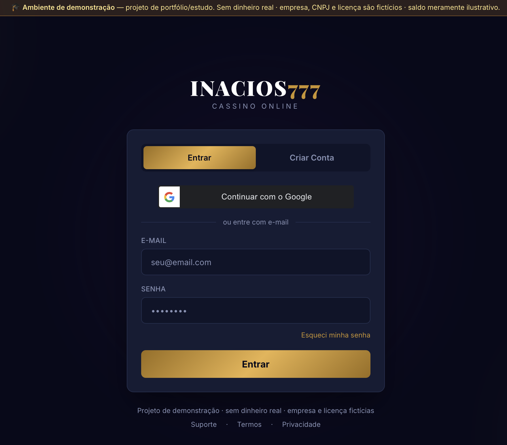
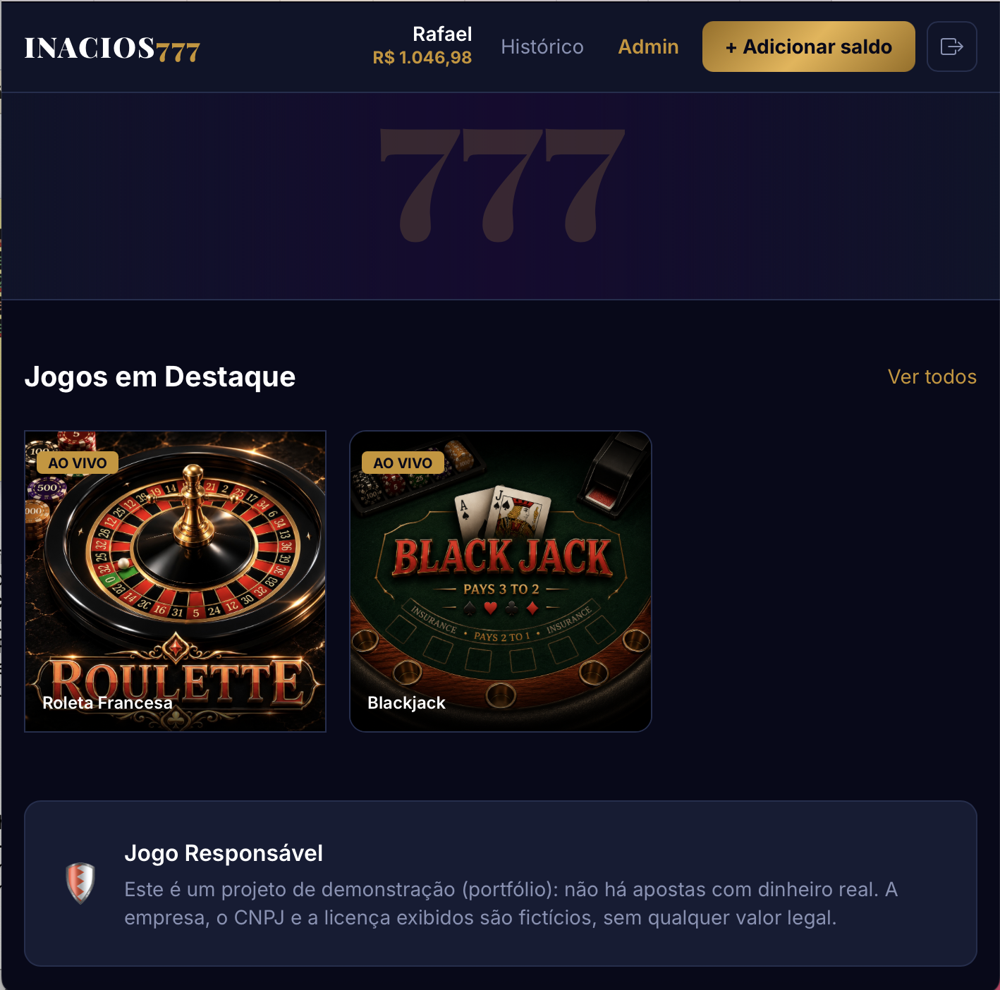

<div align="center">

# 🎰 INACIOS777

### Plataforma full-stack de cassino — projeto de portfólio

Uma experiência completa de demonstração, do cadastro ao backoffice, com carteira fictícia e jogos cuja lógica é controlada pelo servidor.

[](#aviso-importante)
[](#stack)
[](#stack)
[](#stack)
[](#aviso-importante)

</div>

## Visão geral

O **INACIOS777** demonstra a engenharia de uma aplicação full-stack com autenticação, verificação de identidade (CPF e maioridade), carteira de saldo ilustrativo, histórico, painel administrativo e dois jogos integrados a motores *server-authoritative*.

O foco do projeto é mostrar decisões de arquitetura, segurança transacional e experiência do usuário — não oferecer apostas reais.

## Demonstração visual

<table>
  <tr>
    <td width="50%" align="center">
      
      <br />
      <strong>Autenticação</strong>
      <br />
      <sub>Entrada por e-mail ou Google, com aviso permanente de ambiente demonstrativo.</sub>
    </td>
    <td width="50%" align="center">
      
      <br />
      <strong>Lobby e administração</strong>
      <br />
      <sub>Saldo fictício, histórico, backoffice e acesso aos jogos disponíveis.</sub>
    </td>
  </tr>
  <tr>
    <td width="50%" align="center">
      
      <br />
      <strong>Roleta Francesa</strong>
      <br />
      <sub>Mesa interativa integrada ao saldo demonstrativo e ao motor do backend.</sub>
    </td>
    <td width="50%" align="center">
      
      <br />
      <strong>Blackjack</strong>
      <br />
      <sub>Rodadas com ações, estado e liquidação decididos no servidor.</sub>
    </td>
  </tr>
</table>

<a id="aviso-importante"></a>

> [!IMPORTANT]
> **Ambiente de demonstração — não é um cassino real.** Não movimenta dinheiro de verdade, não possui licença de operação e não processa pagamentos. A empresa, o CNPJ, a licença e os saldos exibidos são fictícios e servem somente para dar contexto ao projeto de portfólio.
>
> Este software **não deve ser usado para operar jogos com dinheiro real**.

---

## Índice

- [Visão geral](#visão-geral)
- [Demonstração visual](#demonstração-visual)
- [Funcionalidades](#funcionalidades)
- [Arquitetura](#arquitetura)
- [Stack](#stack)
- [Estrutura do repositório](#estrutura-do-repositório)
- [Executando localmente](#executando-localmente)
- [Variáveis de ambiente](#variáveis-de-ambiente)
- [API](#api)
- [Segurança](#segurança)
- [Roadmap](#roadmap)
- [Licença](#licença)

---

## Funcionalidades

### Conta do jogador
- Cadastro com **CPF validado** (dígitos verificadores), data de nascimento e checagem de **maioridade (18+)**
- Login com e-mail/senha (bcrypt, cost 12) e **Google OAuth** com completamento obrigatório de perfil
- **Verificação de e-mail obrigatória** antes do acesso ao lobby (token de 48h com reenvio)
- Sessão via JWT com expiração configurável

### Carteira (saldo de demonstração)
- **Adicionar saldo:** crédito instantâneo de um saldo fictício para testar os jogos — sem pagamento, sem QR Code, sem integração bancária
- Extrato de transações (créditos) com paginação
- Toda mutação de carteira gera registro em `transactions` com transação SQL atômica e proteção contra saldo negativo no banco

### Jogos
- **Roleta Francesa** com **motor server-authoritative**: apostas validadas e debitadas no servidor, sorteio com RNG criptográfico, pagamento 36/n com *la partage* e registro de cada rodada em `game_rounds` — o navegador apenas anima o resultado
- Proteção contra rodadas concorrentes (lock transacional — sem double-spend) e limites de mesa configuráveis
- **Blackjack** com motor server-side completo: deal/hit/stand/double/split/insurance decididos no servidor (shoe de 6 baralhos com RNG criptográfico, dealer e pagamentos liquidados no backend, estado da mão no banco)
- Lobby com vitrine de jogos no padrão visual da casa (dark navy + dourado)

### Backoffice (admin)
- Dashboard com **GGR** (apostado − pago), saldo creditado, pendências, jogadores ativos e atividade diária (30 dias)
- Listagem de transações com filtros e de jogadores com busca (nome, e-mail, CPF)
- Controle de acesso por perfil (`is_admin`) em middleware dedicado

---

## Arquitetura

```
┌──────────────────────────┐         ┌───────────────────────────────┐
│  Frontend — React/Vite   │  /api   │   Backend — Node.js/Express   │
│  Tailwind · React Router │ ──────▶ │   Helmet · CORS · JWT         │
│  porta 5173 (proxy /api) │         │   porta 3001                  │
└──────────────────────────┘         └───────┬───────────┬───────────┘
                                             │           │
                                   ┌─────────▼──┐   ┌────▼─────────────┐
                                   │ PostgreSQL │   │ Integrações      │
                                   │ users      │   │ · Google OAuth   │
                                   │ transações │   │ · SMTP (Brevo)   │
                                   │ rodadas    │   │                  │
                                   └────────────┘   └──────────────────┘
```

**Princípios adotados:**
- Operações de carteira em **transações SQL atômicas** (`BEGIN/COMMIT/ROLLBACK`) com proteção contra saldo negativo no próprio banco
- Toda mutação de carteira gera registro em `transactions` com ciclo de vida (`pending → completed`)
- Lógica de jogo *server-authoritative*: o resultado é decidido e liquidado no backend; o cliente só exibe
- Segredos fora do código (`.env` não versionado)

## Stack

| Camada | Tecnologias |
|---|---|
| Frontend | React 18, Vite 5, Tailwind CSS 3, React Router 6, Axios, @react-oauth/google |
| Backend | Node.js 18+, Express 4, express-validator, Helmet, JWT, bcryptjs |
| Banco de dados | PostgreSQL 14+ (driver `pg`, migrações SQL versionadas) |
| E-mail | Nodemailer (SMTP Brevo em produção, Ethereal em desenvolvimento) |
| Autenticação social | Google Identity Services (google-auth-library) |

## Estrutura do repositório

```
.
├── README.md / ROADMAP.md        # documentação do projeto
├── backend/
│   ├── src/
│   │   ├── app.js                # entry point da API
│   │   ├── routes/               # auth, wallet, admin, roulette, blackjack
│   │   ├── controllers/          # regras de negócio (auth, carteira, admin)
│   │   ├── services/             # emailService, cpfService, engines de jogo
│   │   ├── middleware/           # autenticação JWT e autorização admin
│   │   ├── models/               # User, Transaction, GameRound
│   │   └── config/database.js    # pool PostgreSQL
│   ├── database/migrations/      # schema versionado
│   └── .env.example
├── frontend/
│   ├── src/
│   │   ├── pages/                # Auth, Lobby, Histórico, Admin, VerifyEmail
│   │   ├── components/wallet/    # modal de saldo (demonstração)
│   │   ├── context/AuthContext   # estado global de sessão
│   │   └── services/api.js       # cliente HTTP
│   └── public/
│       ├── roulette-fr/          # jogo Roleta Francesa (integrado à carteira)
│       └── blackjack/            # jogo Blackjack (integrado à carteira)
└── French Roulette-2/            # base original do jogo de roleta (referência)
```

## Executando localmente

### Pré-requisitos
- Node.js 18+ e npm
- PostgreSQL 14+ em execução

### 1. Banco de dados

```bash
createdb inacios777
for f in backend/database/migrations/*.sql; do psql -d inacios777 -f "$f"; done
```

### 2. Backend

```bash
cd backend
cp .env.example .env      # preencha as variáveis (ver tabela abaixo)
npm install
npm run dev               # http://localhost:3001/api/health
```

### 3. Frontend

```bash
cd frontend
cp .env.example .env      # opcional: VITE_GOOGLE_CLIENT_ID
npm install
npm run dev               # http://localhost:5173 (proxy /api → 3001)
```

## Variáveis de ambiente

Modelos completos em [`backend/.env.example`](backend/.env.example) e [`frontend/.env.example`](frontend/.env.example).

| Grupo | Variáveis | Observação |
|---|---|---|
| Servidor | `PORT`, `NODE_ENV`, `FRONTEND_URL` | CORS restrito à URL do frontend |
| Banco | `DB_HOST`, `DB_PORT`, `DB_NAME`, `DB_USER`, `DB_PASSWORD` | PostgreSQL |
| Sessão | `JWT_SECRET`, `JWT_EXPIRES_IN` | troque o segredo em produção |
| Limites de mesa | `ROULETTE_MIN_BET`, `ROULETTE_MAX_BET`, `BLACKJACK_MIN_BET`, `BLACKJACK_MAX_BET` | valores por rodada |
| Google | `GOOGLE_CLIENT_ID` (backend) / `VITE_GOOGLE_CLIENT_ID` (frontend) | vazio = botão Google oculto |
| E-mail | `SMTP_HOST`, `SMTP_PORT`, `SMTP_SECURE`, `SMTP_USER`, `SMTP_PASS`, `SMTP_FROM` | sem SMTP, usa Ethereal (caixa de teste) |

## API

Base: `http://localhost:3001/api` — rotas autenticadas exigem `Authorization: Bearer <token>`.

| Método | Rota | Auth | Descrição |
|---|---|---|---|
| GET | `/health` | — | Health check |
| POST | `/auth/register` | — | Cadastro (nome, e-mail, CPF, nascimento, senha) |
| POST | `/auth/login` | — | Login e-mail/senha → JWT |
| POST | `/auth/google` | — | Login/cadastro via token Google |
| GET | `/auth/verify-email/:token` | — | Confirma e-mail |
| POST | `/auth/resend-verification` | ✓ | Reenvia e-mail de confirmação |
| POST | `/auth/complete-profile` | ✓ | CPF + nascimento (contas Google) |
| GET | `/auth/me` | ✓ | Dados do usuário logado |
| GET | `/wallet/balance` | ✓ | Saldo atual |
| GET | `/wallet/transactions` | ✓ | Extrato paginado |
| POST | `/wallet/deposit` | ✓ | Credita saldo de demonstração (sem pagamento real) |
| POST | `/roulette/spin` | ✓ | Rodada de roleta: valida apostas, debita, sorteia (RNG no servidor), paga e registra — tudo em uma transação |
| GET | `/roulette/history` | ✓ | Histórico de rodadas do jogador |
| POST | `/blackjack/deal` | ✓ | Inicia rodada de blackjack (debita aposta, distribui) |
| POST | `/blackjack/{hit,stand,double,split,insurance}` | ✓ | Ações da rodada — sorteio e liquidação no servidor |
| GET | `/blackjack/active` | ✓ | Retoma rodada em andamento |
| GET | `/admin/stats` | admin | Dashboard (GGR, créditos, jogadores) |
| GET | `/admin/transactions` | admin | Transações com filtros |
| GET | `/admin/players` | admin | Jogadores com busca |

## Segurança

**Implementado:** Helmet, CORS restrito, JWT, bcrypt cost 12, validação de entrada (express-validator), transações SQL atômicas com lock de linha nas rodadas de jogo, RNG criptográfico no servidor, proteção de saldo negativo no banco, verificação de e-mail obrigatória, segredos fora do versionamento (`.env`).

**Pendente (estudo):** rate limiting, 2FA, trilha de auditoria. Lista em [ROADMAP.md](ROADMAP.md).

> **🔞 Conteúdo temático adulto (jogo de azar simulado).** Este é um ambiente de demonstração sem dinheiro real.

## Roadmap

O documento [ROADMAP.md](ROADMAP.md) consolida, fase a fase, o que foi entregue e o que segue como ideia de evolução do estudo.

## Licença

Código de uso pessoal/portfólio — © 2026 inacios777. Os jogos em `French Roulette-2/` e `frontend/public/` derivam de assets de terceiros; consulte os termos originais antes de redistribuir.
